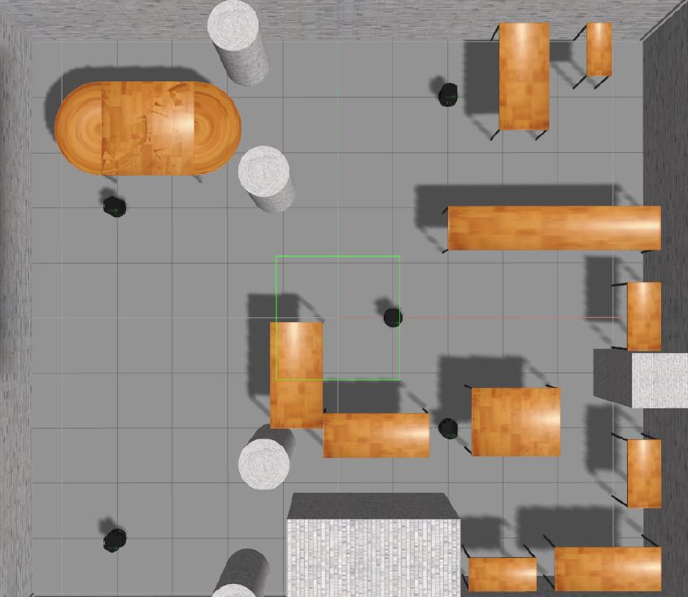

# Project - Multi robot navigation in dynamic environments

* This Project Implements A* Path Planning Algorithm for a differential drive robot.
* This Project is also simulated using 5 Turtlebot 2 robots using ROS Gazebo
* This project is a framework for multiple robot navigation

* The Project Majorly inherists Multi-Agent Navigation Algorithm from the following paper:

`Abhijeet Ravankar, Ankit A. Ravankar, Yukinori Kobayashi, Takanori
Emaru, ”Can robots help each other to plan optimal paths in dynamic
maps?”, 56th Annual Conference of the Society of Instrument and
Control Engineers of Japan, November, 2017.`

## Map of the environment 
The Following Map is used to plan the path

<em>Map of RRL Lab</em>

## Dependencies
following packages have to be imported for running this file 

* python 3.5 or above
* Gazebo 7 or above
* ROS Kinetic
* numpy
* math
* queue
* argparse
* matplotlib.pyplot

## Execution
This project is still in progress. Hello
This project is still in progress.

### The Environment 

<em>Multiple TurtleBots Spawned in the Environment</em>

